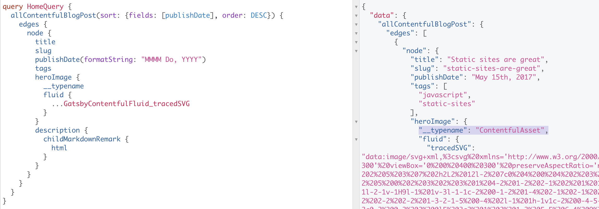

<!-- ix-docs-ignore -->


`@imgix/gatsby` is a multi-faceted plugin to help the developer use [imgix](https://www.imgix.com) with Gatsby.

[](https://www.npmjs.com/package/@imgix/gatsby)
[](https://www.npmjs.com/package/@imgix/gatsby)
[](https://travis-ci.com/imgix/gatsby)
[](https://david-dm.org/imgix/gatsby)
[](https://github.com/imgix/gatsby/blob/main/packages/gatsby/LICENSE)
[](https://app.fossa.com/projects/git%2Bgithub.com%2Fimgix%2Fgatsby?ref=badge_shield)
[](https://github.com/prettier/prettier)<!-- ALL-CONTRIBUTORS-BADGE:START - Do not remove or modify this section -->
[](#contributors)

<!-- ALL-CONTRIBUTORS-BADGE:END -->

---

<!-- /ix-docs-ignore -->

<!-- NB: Run `npx markdown-toc README.md --maxdepth 4 | sed -e 's/[[:space:]]\{2\}/    /g' | pbcopy` to generate TOC :) -->

<!-- prettier-ignore-start -->

- [Overview / Resources](#overview--resources)
- [Why use imgix instead of gatsby-transform-sharp?](#why-use-imgix-instead-of-gatsby-transform-sharp)
- [Get started](#get-started)
- [Usage](#usage)
    * [What section should I read?](#what-section-should-i-read)
    * [GraphQL transform API](#graphql-transform-api)
        + [Configuration](#configuration)
        + [✨ New ✨ GatsbyImage support](#-new--gatsbyimage-support)
        + [Fluid Images](#fluid-images)
        + [Fixed Images](#fixed-images)
        + [Generating imgix URLs](#generating-imgix-urls)
    * [GraphQL `imgixImage` API](#graphql-imgiximage-api)
        + [Configuration](#configuration-1)
        + [✨ New ✨ GatsbyImage support](#-new--gatsbyimage-support-1)
        + [Fluid Images](#fluid-images-1)
        + [Fixed Images](#fixed-images-1)
        + [Generating imgix URLs](#generating-imgix-urls-1)
        + [Using a Web Proxy Source](#using-a-web-proxy-source)
    * [URL Transform Function](#url-transform-function)
        + [✨ New ✨ Gatsby-plugin-image Component and Hook](#-new--gatsby-plugin-image-component-and-hook)
        + [Basic Fluid Image](#basic-fluid-image)
        + [Basic Fixed Image](#basic-fixed-image)
- [API](#api)
    * [GraphQL](#graphql)
        + [GraphQL Fragments](#graphql-fragments)
    * [Gatsby/Plugin Configuration](#gatsbyplugin-configuration)
    * [URL Transform Function](#url-transform-function-1)
        + [`buildFixedImageData`](#buildfixedimagedata)
        + [`buildFluidImageData`](#buildfluidimagedata)
    * [Third-party integration helpers (e.g. for Gatsby source plugins)](#third-party-integration-helpers-eg-for-gatsby-source-plugins)
        + [createImgixGatsbyTypes](#createimgixgatsbytypes)
- [What is the `ixlib` Param on Every Request?](#what-is-the-ixlib-param-on-every-request)
- [Roadmap](#roadmap)
- [Upgrading from `@imgix/gatsby-transform-url`](#upgrading-from-imgixgatsby-transform-url)
- [Contributors](#contributors)
- [License](#license)

<!-- prettier-ignore-end -->

## Overview / Resources

**Before you get started with this library**, it's _highly recommended_ that you read Eric Portis' [seminal article on `srcset` and `sizes`](https://ericportis.com/posts/2014/srcset-sizes/). This article explains the history of responsive images in responsive design, why they're necessary, and how all these technologies work together to save bandwidth and provide a better experience for users. The primary goal of this library is to make these tools easier for developers to implement, so having an understanding of how they work will significantly improve your experience with this library.

Below are some other articles that help explain responsive imagery, and how it can work alongside imgix:

## Why use imgix instead of gatsby-transform-sharp?

Integrating imgix with Gatsby provides a few key advantages over the core image experience in Gatsby:

1. Far-reduced build time and better developer experience. Since we offload the image rendering to our cloud, we free up your machine from doing complex image transformations, meaning your builds are as snappy as they can be.
2. Access to imgix's suite of transformations and optimizations. imgix has a larger variety of image transformations than are possible with the built in Gatsby system. Furthermore, we are continuously improving our image optimization to push the boundaries of image performance.
3. Better image responsiveness on the page. As we are able to create far more derivative images at different resolutions due to our cloud rendering stack, we can offer an image closer to the source resolution of your users' browsers, meaning faster load times and less bandwidth usage for your users (and you!).
4. Access to imgix's best-in-class CDN. imgix has invested significant time and effort into a world-leading CDN, which ensures images are delivered your website's customers as quick as possible.
5. Faster time-to-awesome. imgix offers a set of default optimizations which allow you to achieve outstanding image quality which still keeping image size small, and allows you to focus on other aspects of your website.

## Get started

Firstly, this library requires an imgix account, so please follow this [quick start guide](https://docs.imgix.com/setup/quick-start) if you don't have an account.

Then, install this library with the following commands, depending on your package manager.

- **NPM**: `npm install @imgix/gatsby`
- **Yarn**: `yarn add @imgix/gatsby`

Finally, check out the section in the usage guide below that most suits your needs.

## Usage

### What section should I read?

To find what part of this usage guide you should read, select the use case below that best matches your use case:

- I have images provided by a **Gatsby source** (e.g. Contentful, Prismic) 👉 [graphql transform node API](#graphql-transform-API)
- My images are statically defined at build time 👉 [graphql `imgixImage` API](#graphql-imgiximage-api)
- My images are set dynamically (e.g. loaded from REST API on client) 👉 [url tranform function](#url-transform-function)

### GraphQL transform API

This feature can be best thought of as a replacement for gatsby-image-sharp, for images that are provided by Gatsby Source plugins, such as Contentful or Prismic. These plugins provide data that is accessed with the Gatsby GraphQL API, with images that are stored on the internet. This plugin can transform those images using imgix, and serve them to your customers.

#### Configuration

This source must be configured in your `gatsby-config` file as follows:

```js
// Add to start of file
const { ImgixSourceType } = require('@imgix/gatsby');

module.exports = {
  //...
  plugins: [
    // your other plugins here
    {
      resolve: `@imgix/gatsby`,
      options: {
        // This is the domain of your imgix source, which can be created at
        // https://dashboard.imgix.com/.
        // Only "Web Proxy" imgix sources can be used for this configuration.
        domain: 'example.imgix.net',

        // This is the source's secure token. Can be found under the "Security"
        // heading in your source's configuration page, and revealed by tapping
        // "Show Token".
        secureURLToken: 'abcABC123',

        // This configures the plugin to work in proxy mode.
        sourceType: ImgixSourceType.WebProxy,

        // These are some default imgix parameters to set for each image. It is
        // recommended to have at least this minimal configuration.
        defaultImgixParams: { auto: 'format,compress' },

        // This configures which nodes to modify.
        fields: [
          // Add an object to this array for each node type you want to modify. Follow the instructions below for this.
        ],
      },
    },
  ],
};
```

##### Adding a `fields` item correctly

It's necessary to add a configuration for each GraphQL node type you would like to modify. For example, if you have a page which queries both for blog posts, and also blog post categories, you will need to add items for each type separately.

The first step is to find the node type you would like to modify. To do this, look at the GraphQL query for the image you would like to modify. You need to find the node type for the node that image belongs to. For example, for the following query, the node type is `ContentfulAsset`, since that is the type of `heroImage`. This can be confirmed by copying the query into the GraphiQL editor and hovering over the node type. More detailed instructions on how to find the node types can be found in [this section](#finding-a-nodes-type)

```graphql
query HomeQuery {
  allContentfulBlogPost {
    nodes {
      heroImage { # this is the node to modify
        fluid {...}
      }
    }
  }

}
```

Then, you need to configure a field for this node type. The quickest way to configure this is to see if the examples below include a configuration for the node that you would like to transform. If it exists, just copy and paste that into the list of `fields`, and you're done. Otherwise, skip to the section for manual setup.

###### gatsby-source-contentful

```js
// ContentfulAsset
{
  nodeType: "ContentfulAsset",
  fieldName: "imgixImage",
  getURL: node => `https:${node.file.url}`
},
```

###### gatsby-source-datocms

```js
{
  nodeType: "DatoCmsAsset",
  getURL: node => node.entityPayload.attributes.url,
  fieldName: "imgixImage",
},
```

###### gatsby-source-drupal

```js
// Drupal
{
  nodeType: 'File',
  getURL: (node) => node.url,
  fieldName: 'imgixImage',
},
```

###### Manual config (if your node type doesn't exist above)

```js
{
  // This is the GraphQL node type that you want to modify. There's
  // more info on how to find this below.
  nodeType: '',

  // This is used to pull the raw image URL from the node you want to
  // transform. It is passed the node to transform as an argument, and
  // expects a URL to be returned.
  // See more information below on how to set this.
  getURL: (node) => node.imageUrl,

  // This is the name of imgix field that will be added to the type.
  fieldName: 'imgixImage',
},
```

The `getURL` function needs to return a **fully-qualified URL**.

The steps to setting this value correctly is:

1. Set the function to this:

   ```js
   getURL: (node) => {
     console.log(node);
   };
   ```

2. Inspect the logged output. The plugin will try to find a suitable image url in the node's data for you, and if it successfully finds one, it will output the code to replace the function with in the corresponding error message.

   For example, for `ContentfulAsset`, it will display the following error message:

   ```txt
   Error when resolving URL value for node type ContentfulAsset. This
   probably means that the getURL function in gatsby-config.js is
   incorrectly set. Please read this project's README for detailed
   instructions on how to set this correctly.

   Potential images were found at these paths:
    - file.url
      Usage: getURL: (node) => `https:${node.file.url}`
   ```

   As we can see, the correct value for the function is

   ```js
   getURL: (node) => `https:${node.file.url}
   ```

   If no value was suggested, you will need to inspect the logged output to find a suitable image URL that corresponds to the image you want to transform. For example, if we're searching ContentfulAsset's data, we see the following output in the console:

   ```js
   {
     // ...
     file: {
       url: '//images.ctfassets.net/../.jpg',
       details: { size: 7316629, image: [Object] },
       fileName: 'image.jpg',
       contentType: 'image/jpeg'
     },
     // ...
   }
   ```

   Therefore, we need to return `file.url`.

3. Set the function to the correct value, **making sure that the URL includes an http or https.** For this example, since the image URL didn't have a `https`, we have to add one:

   ```js
   getURL: (node) => `https:${node.file.url}`;
   ```

##### Finding a node's type

The easiest way to find a node's type is to copy the query to the GraphiQL explorer (can be found at [localhost:8000/\_\_graphql](http://localhost:8000/__graphql)). Then, while holding Cmd or Ctrl, hover over the node that you are trying to find the type for.

In the screenshot below, we have hovered over the `heroImage` field, and we can see the type is `ContentfulAsset`. This is the value we can set in the plugin's config.


It's also possible to add `__typeName` to the GraphQL query to find the node type. This is useful if you are unable to use the GraphiQL explorer. Here we can see again that the node type is `ContentfulAsset`



##### Default imgix parameters

Setting `auto: ['format', 'compress']` is highly recommended. This will re-format the image to the format that is best optimized for your browser, such as WebP. It will also reduce unnecessary wasted file size, such as transparency on a non-transparent image. More information about the auto parameter can be found [here](https://docs.imgix.com/apis/url/auto/auto).

#### ✨ New ✨ GatsbyImage support

This plugin now supports the latest `GatsbyImage` component, which delivers better performance and Lighthouse scores, while improving the developer experience.

To use this plugin with `GatsbyImage`, the usage is quite similar to the normal usage with `gatsby-plugin-image`. This plugin exposes a `gatsbyImageData` GraphQL field which is very similar to the native field.

Example:

```jsx
import gql from 'graphql-tag';
import Img from 'gatsby-image';
import { GatsbyImage } from 'gatsby-plugin-image';

export default ({ data }) => {
  return (
    <GatsbyImage
      image={data.allContentfulAsset.edges[0].node.imgixImage.gatsbyImageData}
    />
  );
};

export const query = gql`
  {
    allContentfulAsset {
      edges {
        node {
          imgixImage {
            gatsbyImageData(width: 400, imgixParams: {})
          }
        }
      }
    }
  }
`;
```

##### Shared field params

The `layout`, `width`, `height`, `aspectRatio`, `outputPixelDensities`, `breakpoints`, `sizes`, and `backgroundColor` parameters are identical to the parameters offered by the native `gatsbyImageData` field, and the documentation for those fields can be found in the [Gatsby documentation](https://www.gatsbyjs.com/docs/reference/built-in-components/gatsby-plugin-image/#image-options). The other added parameters are specific to imgix and they are documented in the GraphQL type definitions, which can be explored in GraphiQL (usually at [http://localhost:8000/\_\_graphiql](http://localhost:8000/__graphiql))

#### Fluid Images

The following code will render a fluid image with gatsby-image. This code should already be familiar to you if you've used gatsby-image in the past.

```jsx
import gql from 'graphql-tag';
import Img from 'gatsby-image';

export default ({ data }) => {
  return (
    
  );
};

export const query = gql`
  {
    allContentfulAsset {
      edges {
        node {
          imgixImage {
            fluid(imgixParams: {
              // pass any imgix parameters you want to here
            }) {
              ...GatsbyImgixFluid
            }
          }
        }
      }
    }
  }
`;
```

A full list of imgix parameters can be found [here](https://docs.imgix.com/apis/url).

Although `sizes` is optional, it is highly recommended. It has a default of `(max-width: 8192px) 100vw, 8192px`, which means that it is most likely loading an image too large for your users. Some examples of what you can set sizes as are:

- `500px` - the image is a fixed width. In this case, you should use fixed mode, described in the next section.
- `(min-width: 1140px) 1140px, 100vw` - under 1140px, the image is as wide as the viewport. Above 1140px, it is fixed to 1140px.

<!-- A full example of a fluid image in a working Gatsby repo can be found on CodeSandbox.

[](https://codesandbox.io/s/imgixgatsby-transform-url-fluid-example-i49fo?fontsize=14&hidenavigation=1&theme=dark) -->

#### Fixed Images

The following code will render a fixed image with gatsby-image. This code should already be familiar to you if you've used gatsby-image in the past.

```jsx
import gql from 'graphql-tag';
import Img from 'gatsby-image';

export default ({ data }) => {
  return ;
};

export const query = gql`
  {
    allContentfulAsset {
      edges {
        node {
          imgixImage {
            fixed(
              width: 960 # Width (in px) is required
              imgixParams: {}
            ) {
              ...GatsbyImgixFixed
            }
          }
        }
      }
    }
  }
`;
```

A full list of imgix parameters can be found [here](https://docs.imgix.com/apis/url).

<!-- An example of this mode in a full working Gatsby repo can be found on CodeSandbox.

[](https://codesandbox.io/s/imgixgatsby-transform-url-fixed-example-ce324?fontsize=14&hidenavigation=1&theme=dark) -->

#### Generating imgix URLs

If you would rather not use gatsby-image and would instead prefer just a plain imgix URL, you can use the `url` field to generate one. For instance, you could generate a URL and use it for the background image of an element:

```jsx
import gql from 'graphql-tag';

export default ({ data }) => {
  return (
    <div
      style={{
        backgroundImage: `url(${data.allContentfulAsset.edges[0].node.imgixImage.url})`,
        backgroundSize: 'contain',
        width: '100vw',
        height: 'calc(100vh - 64px)',
      }}
    >
      <h1>Blog Title</h1>
    </div>
  );
};

export const query = gql`
  {
    allContentfulAsset {
      edges {
        node {
          imgixImage {
            url(imgixParams: { w: 1200, h: 800 })
          }
        }
      }
    }
  }
`;
```

### GraphQL `imgixImage` API

This feature can be best thought about as a replacement for gatsby-image-sharp for images that are statically defined at build time. This allows imgix URLs to be used with gatsby-image through the Gatsby GraphQL API. This feature transforms imgix URLs into a format that is compatible with gatsby-image. This can generate either fluid or fixed images. With this feature you can either display images that already exist on imgix, or proxy other images through imgix.

This feature supports many of the existing gatsby-image GraphQL that you know and love, and also supports most of the features of gatsby-image, such as blur-up and lazy loading. It also brings all of the great features of imgix, including the extensive image transformations and optimisations, as well as the excellent imgix CDN.

#### Configuration

This source must be configured in your `gatsby-config` file as follows:

```js
module.exports = {
  //...
  plugins: [
    // your other plugins here
    {
      resolve: `@imgix/gatsby`,
      options: {
        domain: '<your imgix domain, e.g. acme.imgix.net>',
        defaultImgixParams: ['auto', 'format'],
      },
    },
  ],
};
```

Setting `auto: ['format', 'compress']` is highly recommended. This will re-format the image to the format that is best optimized for your browser, such as WebP. It will also reduce unnecessary wasted file size, such as transparency on a non-transparent image. More information about the auto parameter can be found [here](https://docs.imgix.com/apis/url/auto/auto).

#### ✨ New ✨ GatsbyImage support

This plugin now supports the latest `GatsbyImage` component, which delivers better performance and Lighthouse scores, while improving the developer experience.

To use this plugin with `GatsbyImage`, the usage is quite similar to the normal usage with `gatsby-plugin-image`. This plugin exposes a `gatsbyImageData` GraphQL field which is very similar to the native field.

Example:

```jsx
import gql from 'graphql-tag';
import Img from 'gatsby-image';
import { GatsbyImage } from 'gatsby-plugin-image';

export default ({ data }) => {
  return <GatsbyImage image={data.imgixImage.gatsbyImageData} />;
};

export const query = gql`
  {
    imgixImage(url: "https://assets.imgix.net/amsterdam.jpg") {
      gatsbyImageData(width: 400, imgixParams: {})
    }
  }
`;
```

##### Shared field params

The `layout`, `width`, `height`, `aspectRatio`, `outputPixelDensities`, `breakpoints`, `sizes`, and `backgroundColor` parameters are identical to the parameters offered by the native `gatsbyImageData` field, and the documentation for those fields can be found in the [Gatsby documentation](https://www.gatsbyjs.com/docs/reference/built-in-components/gatsby-plugin-image/#image-options). The other added parameters are specific to imgix and they are documented in the GraphQL type definitions, which can be explored in GraphiQL (usually at [http://localhost:8000/\_\_graphiql](http://localhost:8000/__graphiql))

#### Fluid Images

The following code will render a fluid image with gatsby-image. This code should already be familiar to you if you've used gatsby-image in the past.

```jsx
import gql from 'graphql-tag';
import Img from 'gatsby-image';

export default ({ data }) => {
  return ;
};

export const query = gql`
  {
    imgixImage(url: "/image.jpg") {
      fluid(imgixParams: {
        // pass any imgix parameters you want to here
      }) {
        ...GatsbyImgixFluid
      }
    }
  }
`;
```

A full list of imgix parameters can be found [here](https://docs.imgix.com/apis/url).

Although `sizes` is optional, it is highly recommended. It has a default of `(max-width: 8192px) 100vw, 8192px`, which means that it is most likely loading an image too large for your users. Some examples of what you can set sizes as are:

- `500px` - the image is a fixed width. In this case, you should use fixed mode, described in the next section.
- `(min-width: 1140px) 1140px, 100vw` - under 1140px, the image is as wide as the viewport. Above 1140px, it is fixed to 1140px.

<!-- A full example of a fluid image in a working Gatsby repo can be found on CodeSandbox.

[](https://codesandbox.io/s/imgixgatsby-transform-url-fluid-example-i49fo?fontsize=14&hidenavigation=1&theme=dark) -->

#### Fixed Images

The following code will render a fixed image with gatsby-image. This code should already be familiar to you if you've used gatsby-image in the past.

```jsx
import gql from 'graphql-tag';
import Img from 'gatsby-image';

export default ({ data }) => {
  return ;
};

export const query = gql`
  {
    imgixImage(url: "/image.jpg") {
      fixed(
        width: 960 # Width (in px) is required
        imgixParams: {}
      ) {
        ...GatsbyImgixFixed
      }
    }
  }
`;
```

A full list of imgix parameters can be found [here](https://docs.imgix.com/apis/url).

<!-- An example of this mode in a full working Gatsby repo can be found on CodeSandbox.

[](https://codesandbox.io/s/imgixgatsby-transform-url-fixed-example-ce324?fontsize=14&hidenavigation=1&theme=dark) -->

#### Generating imgix URLs

If you would rather not use gatsby-image and would instead prefer just a plain imgix URL, you can use the `url` field to generate one. For instance, you could generate a URL and use it for the background image of an element:

```jsx
import gql from 'graphql-tag';

export default ({ data }) => {
  return (
    <div
      style={{
        backgroundImage: `url(${data.imgixImage.url})`,
        backgroundSize: 'contain',
        width: '100vw',
        height: 'calc(100vh - 64px)',
      }}
    >
      <h1>Blog Title</h1>
    </div>
  );
};

export const query = gql`
  {
    imgixImage(url: "/image.jpg") {
      url(imgixParams: { w: 1200, h: 800 })
    }
  }
`;
```

#### Using a Web Proxy Source

If you would like to proxy images from another domain, you should set up a [Web Proxy Source](https://docs.imgix.com/setup/creating-sources/web-proxy). After doing this, you can use this source with this plugin as follows:

1. Set the plugin config in `gatsby-config.js` to the following:

```js
module.exports = {
  //...
  plugins: [
    // your other plugins here
    {
      resolve: `@imgix/gatsby-source-url`,
      options: {
        domain: '<your proxy source domain, e.g. my-proxy-source.imgix.net>',
        secureURLToken: '...', // <-- now required, your "Token" from your source page
        defaultImgixParams: ['auto', 'format'],
      },
    },
  ],
};
```

2. Pass a **fully-qualified URL** to the `url` parameter in the GraphQL API. For example, to render a fixed image, a page would look like this:

```jsx
import gql from 'graphql-tag';
import Img from 'gatsby-image';

export default ({ data }) => {
  return ;
};

export const query = gql`
  {
    imgixImage(url: "https://acme.com/my-image-to-proxy.jpg") {
      # Now this is a full URL
      fixed(
        width: 960 # Width (in px) is required
      ) {
        ...GatsbyImgixFixed
      }
    }
  }
`;
```

### URL Transform Function

This features allows imgix urls to be used with gatsby-image or gatsby-plugin-image. imgix urls are transformed into a format that is compatible with gatsby-image. This can generate either fluid, fixed images, or for gatsby-plugin-image, full-width, constrained, or fixed images. With this feature you can either display images that already exist on imgix, or proxy other images through imgix. It is important to note that this feature can **only display images that are already on imgix or an imgix-compatible URL**. To display images that are not using imgix, you will have to use one of the GraphQL APIs above.

Unfortunately, due to limitations of Gatsby, this feature does not support blurred placeholders. To use placeholders please use one of the other use cases/parts of this library

#### ✨ New ✨ Gatsby-plugin-image Component and Hook

This plugin supports the new frontend Gatsby-plugin-image component. To use the component with this plugin, use the following code

```jsx
import { ImgixGatsbyImage } from '@imgix/gatsby';

export const MyPageComponent = () => {
  return <ImgixGatsbyImage
    // Must be an imgix URL
    src="https://assets.imgix.net/amsterdam.jpg"

    // This can be used to set imgix params
    imgixParams={ crop: 'faces' }

    // These are passed through to the gatsby-plugin-image component
    layout="constrained"
    width={768}

    // Set either
    aspectRatio={16 / 9}
    // or
    sourceWidth={5000}
    sourceHeight={4000}

    // Any other props offered by the gatsby-plugin-image component are
    // supported and passed straight through to the component
  >
}
```

If you would like more control over the data flow, you can also use the hook that this package exports - `getGatsbyImageData` - like so:

```jsx
import { getGatsbyImageData } from '@imgix/gatsby';
import { GatsbyImage } from 'gatsby-plugin-image';

export const MyPageComponent = () => {
  return <GatsbyImage
    image={getGatsbyImageData({
      // Must be an imgix URL
      src: "https://assets.imgix.net/amsterdam.jpg"
      // This can be used to set imgix params
      imgixParams: { crop: 'faces' }

      // These are passed through to the gatsby-plugin-image component
      layout: "constrained"
      width: 768

      // Set either
      aspectRatio: 16 / 9
      // or
      sourceWidth: 5000
      sourceHeight: 4000
    })}
  >
}
```

#### Basic Fluid Image

The following code will render a fluid image with gatsby-image. This code should already be familiar to you if you've used gatsby-image in the past.

```jsx
import Img from 'gatsby-image';
import { buildFluidImageData } from '@imgix/gatsby';

// Later, in a gatsby page/component.
;
```

`ar` is required, since gatsby-image requires this to generate placeholders. This `ar` will also crop the rendered photo from imgix to the same aspect ratio. If you don't know the aspect ratio of your image beforehand, it is virtually impossible to use gatsby-image in this format, so we either recommend using another of our plugins, or using an `img` directly.

Setting `auto: ['format', 'compress']` is highly recommended. This will re-format the image to the format that is best optimized for your browser, such as WebP. It will also reduce unnecessary wasted file size, such as transparency on a non-transparent image. More information about the auto parameter can be found [here](https://docs.imgix.com/apis/url/auto/auto).

A full list of imgix parameters can be found [here](https://docs.imgix.com/apis/url).

Although `sizes` is optional, it is highly recommended. It has a default of `100vw`, which means that it might be loading an image too large for your users. Some examples of what you can set sizes as are:

- `500px` - the image is a fixed width. In this case, you should use fixed mode, described in the next section.
- `(min-width: 1140px) 1140px, 100vw` - under 1140px, the image is as wide as the viewport. Above 1140px, it is fixed to 1140px.

A full example of a fluid image in a working Gatsby repo can be found on CodeSandbox.

[](https://codesandbox.io/s/imgixgatsby-transform-url-fluid-example-jxj0b?fontsize=14&hidenavigation=1&theme=dark)

#### Basic Fixed Image

The following code will render a fixed image with gatsby-image. This code should already be familiar to you if you've used gatsby-image in the past.

```jsx
import Img from 'gatsby-image';
import { buildFixedImageData } from '@imgix/gatsby';

// Later, in a gatsby page/component.
;
```

The imgix parameters `w` and `h` are required, since these are used by gatsby-image to display a placeholder while the image is loading. Other imgix parameters can be added below the width and height.

Setting `auto: ['format', 'compress']` is highly recommended. This will re-format the image to the format that is best optimized for your browser, such as WebP. It will also reduce unnecessary wasted file size, such as transparency on a non-transparent image. More information about the auto parameter can be found [here](https://docs.imgix.com/apis/url/auto/auto).

A full list of imgix parameters can be found [here](https://docs.imgix.com/apis/url).

An example of this mode in a full working Gatsby repo can be found on CodeSandbox.

[](https://codesandbox.io/s/imgixgatsby-transform-url-fixed-example-ce324?fontsize=14&hidenavigation=1&theme=dark)

## API

### GraphQL

The majority of the API for this library can be found by using the GraphiQL inspector (usually at `https://localhost:8000/__graphql`).

#### GraphQL Fragments

This library also provides some GraphQL fragments, such as `GatsbyImgixFluid`, and `GatsbyImgixFluid_noBase64`. The values of these fragments can be found at [fragments.js](./fragments.js)

### Gatsby/Plugin Configuration

The plugin options that can be specified in `gatsby-config.js` are:

| Name                 | Type      | Required | Description                                                                                                                                                     |
| :------------------- | :-------- | :------- | :-------------------------------------------------------------------------------------------------------------------------------------------------------------- |
| `domain`             | `String`  | ✔️       | The imgix domain to use for the image URLs. Usually in the format `.imgix.net`                                                                                  |
| `defaultImgixParams` | `Object`  |          | Imgix parameters to use by default for every image. Recommended to set to `{ auto: ['compress', 'format'] }`.                                                   |
| `disableIxlibParam`  | `Boolean` |          | Set to `true` to remove the `ixlib` param from every request. See [this section](#what-is-the-ixlib-param-on-every-request) for more information.               |
| `secureURLToken`     | `String`  |          | When specified, this token will be used to sign images. Read more about securing images [on the imgix Docs site](https://docs.imgix.com/setup/securing-images). |

### URL Transform Function

#### `buildFixedImageData`

```ts
function buildFixedImageData(
  /**
   * An imgix url to transform, e.g. https://yourdomain.imgix.net/your-image.jpg
   */
  url: string,
  /**
   * A set of imgix parameters to apply to the image.
   * Parameters ending in 64 will be base64 encoded.
   * A full list of imgix parameters can be found here: https://docs.imgix.com/apis/url
   * Width (w) and height (h) are required.
   */
  imgixParams: { w: number; h: number } & IImgixParams,
  /**
   * Options that are not imgix parameters.
   * Optional.
   */
  options?: {
    /**
     * Disable the ixlib diagnostic param that is added to every url.
     */
    includeLibraryParam?: boolean;
  },
): {
  width: number;
  height: number;
  src: string;
  srcSet: string;
  srcWebp: string;
  srcSetWebp: string;
};
```

#### `buildFluidImageData`

```ts
export function buildFluidImageData(
  /**
   * An imgix url to transform, e.g. https://yourdomain.imgix.net/your-image.jpg
   */
  url: string,
  /**
   * A set of imgix parameters to apply to the image.
   * Parameters ending in 64 will be base64 encoded.
   * A full list of imgix parameters can be found here: https://docs.imgix.com/apis/url
   * The aspect ratio (ar) as a float is required.
   */
  imgixParams: {
    /**
     * The aspect ratio to set for the rendered image and the placeholder.
     * Format: float or string. For float, it can be calculated with ar = width/height. For a string, it should be in the format w:h.
     */
    ar: number | string;
  } & IImgixParams,
  /**
   * Options that are not imgix parameters.
   * Optional.
   */
  options?: {
    /**
     * Disable the ixlib diagnostic param that is added to every url.
     */
    includeLibraryParam?: boolean;
    /**
     * The sizes attribute to set on the underlying image.
     */
    sizes?: string;
  },
): {
  aspectRatio: number;
  src: string;
  srcSet: string;
  srcWebp: string;
  srcSetWebp: string;
  sizes: string;
};
```

### Third-party integration helpers (e.g. for Gatsby source plugins)

This section is for third-party plugin developers of Gatsby plugins and sources that would like to expose the functionality of this library inside their own plugins natively. For example, the [Prismic Gatsby plugin](https://github.com/angeloashmore/gatsby-source-prismic) uses these APIs to expose `fixed`, `fluid`, `url`, and `gatsbyImageData` fields on its images that it exposes in its GraphQL API.

#### createImgixGatsbyTypes

This is the main function that should be used to reuse functionality from this library.

##### API

| Parameter          | Type                              | Required | Description                                                                                                                                                                                                                                                                       |
| ------------------ | --------------------------------- | -------- | --------------------------------------------------------------------------------------------------------------------------------------------------------------------------------------------------------------------------------------------------------------------------------- |
| imgixClientOptions | `Object`                          |          | Any extra configuration to pass to new ImgixClient from @imgix/js-core (see [here](https://github.com/imgix/js-core#configuration) for more information).                                                                                                                         |
| resolveUrl         | `(source) => string \| undefined` | ✔        | A callback to resolve the image URL from the source data provided to the resolver. The source data is provided by the resolver of the type you are adding the image fields too.                                                                                                   |
| resolveWidth       | `(source) => number \| undefined` |          | This callback can be used to provide the source (uncropped) width of the target image from the source data, if known. The data passed to this callback is the same as is passed to `resolveUrl`. If this callback is not provided, a network request will be made at build time to resolve this information.                                                                                  |
| resolveHeight      | `(source) => number \| undefined` |          | This callback can be used to provide the source (uncropped) height of the target image from the source data, if known. The data passed to this callback is the same as is passed to `resolveUrl`. If this callback is not provided, a network request will be made at build time to resolve this information.                                                                                 |
| allowListFields    | `Array`                           |          | This can be used to restrict the types and fields generated to avoid creating extra unnecessary types. Possible values: url, fixed, fluid, gatsbyImageData.                                                                                                                       |
| defaultParams      | `Object`                          |          | Default imgix parameters to apply for these images.                                                                                                                                                                                                                               |
| namespace          | `String`                          |          | Prepends the types generated by this library with the supplied namespace to avoid name collisions. It is recommended to set this to something unique to your library so that if your developers import another Gatsby plugin that also this plugin that the names do not collide. |
| cache              | `GatsbyCache`                     | ✔        | The Gatsby cache provided to Gatsby API hooks                                                                                                                                                                                                                                     |

##### Code example

```tsx
// gatsby-node.js
const imgixGatsby = require('@imgix/gatsby/dist/pluginHelpers');

exports.createSchemaCustomization = async (gatsbyContext, options) => {
  const imgixTypes = imgixGatsby.createImgixGatsbyTypes({
    cache: gatsbyContext.cache,
    resolveUrl: (node) => node.imageURL,
    resolveWidth: (node) => node.imageSourceWidth,
    resolveHeight: (node) => node.imageSourceHeight,
    defaultParams: { auto: 'compress,format' },
    namespace: 'Imgix',
    imgixClientOptions: {
      // domain is required if urls are not already imgix urls. If a domain is provided here, and the image urls are not imgix urls, the the imgix source needs to be a web proxy source, and a secureURLToken token is required (see below).
      domain: 'my-imgix-domain.imgix.net',
      // secureURLToken is required if imgix source type is web proxy, or "secure URLs" is enabled in the imgix configuration dashboard
      secureURLToken: 'my-secure-url-token',
    },
  });

  const myNodeType = gatsbyContext.schema.buildObject({
    name: 'MyPluginNodeType',
    fields: {
      // Your other node fields, e.g. title, description, etc
      title: { type: 'String!' },

      // Add the fields returned from createImgixGatsbyTypes to your node as fields
      imageUrl: imgixTypes.fields.url,
      fluid: imgixTypes.fields.fluid,
      fixed: imgixTypes.fields.fixed,
      gatsbyImageData: imgixTypes.fields.gatsbyImageData,
    },
  });

  gatsbyContext.actions.createTypes([
    ...imgixTypes.types.map(gatsbyContext.schema.buildObjectType),
    ...imgixTypes.enumTypes.map(gatsbyContext.schema.buildEnumType),
    ...imgixTypes.inputTypes.map(gatsbyContext.schema.buildInputObjectType),
  ]);
  gatsbyContext.actions.createTypes(myNodeType);
};
```

## What is the `ixlib` Param on Every Request?

For security and diagnostic purposes, we tag all requests with the language and version of library used to generate the URL.

To disable this, set `includeLibraryParam` in the third parameter to `false` when calling one of the two functions this library exports. For example, for `buildFluidImageData`:

```jsx

```

## Roadmap

**📣 Have your say on our roadmap below!**

Hey there! Thanks for checking out this repository. We are currently deciding on the roadmap for this library, and we'd love your help in showing us what to prioritize, and what you'd like us to build. If you're interested, read on!

Below is a list of issues that contain all the high-level use-cases that we thought apply to Gatbsy developers using imgix. Please check out any issues that are interesting, and **help us decide what to build first by voting on those issues that best fit your use case.**

- [I have an image stored in image manager that I want to render](https://github.com/imgix/gatsby/issues/6)
- [I have an image stored locally that I want to upload to image-manager and render](https://github.com/imgix/gatsby/issues/7)

Other features:

- [I want to have my imgix parameters in my Gatsby/GraphQL query be strongly-typed](https://github.com/imgix/gatsby/issues/5)

## Upgrading from `@imgix/gatsby-transform-url`

`@imgix/gatsby-transform-url` was deprecated in favor of combining these sub-projects into one single project, for simplicity.

The functionality of that library can be found, unchanged, under this new package. Specifically, all that needs to changed is the import statements, e.g. from

```js
import { buildFluidImageData } from '@imgix/gatsby-transform-url';
```

to

```js
import { buildFluidImageData } from '@imgix/gatsby';
```

## Contributors

Contributions are a vital part of this library and imgix's commitment to open-source. We welcome all contributions which align with this project's goals. More information can be found in the [contributing documentation](CONTRIBUTING.md).

imgix would like to make a special announcement about the prior work of [Angelo Ashmore](https://github.com/angeloashmore) from [Wall-to-Wall Studios](https://www.walltowall.com/) on his gatsby plugin for imgix. The code and API from his plugin has made a significant contribution to the codebase and API for imgix's official plugins, and imgix is very grateful that he agreed to collaborate with us.


 
<!-- ix-docs-ignore -->

Thanks goes to these wonderful people ([emoji key](https://allcontributors.org/docs/en/emoji-key)):

<!-- ALL-CONTRIBUTORS-LIST:START - Do not remove or modify this section -->
<!-- prettier-ignore-start -->
<!-- markdownlint-disable -->
<table>
  <tr>
    <td align="center"><a href="https://github.com/frederickfogerty"><br /><sub><b>Frederick Fogerty</b></sub></a><br /><a href="https://github.com/imgix/gatsby/commits?author=frederickfogerty" title="Code">💻</a> <a href="https://github.com/imgix/gatsby/commits?author=frederickfogerty" title="Documentation">📖</a> <a href="#maintenance-frederickfogerty" title="Maintenance">🚧</a></td>
    <td align="center"><a href="https://angeloashmore.github.io"><br /><sub><b>Angelo Ashmore</b></sub></a><br /><a href="https://github.com/imgix/gatsby/commits?author=angeloashmore" title="Code">💻</a></td>
    <td align="center"><a href="http://www.luisball.com"><br /><sub><b>Luis H. Ball Jr.</b></sub></a><br /><a href="https://github.com/imgix/gatsby/commits?author=luqven" title="Documentation">📖</a></td>
    <td align="center"><a href="http://sherwinski.com"><br /><sub><b>Sherwin Heydarbeygi</b></sub></a><br /><a href="https://github.com/imgix/gatsby/commits?author=sherwinski" title="Documentation">📖</a></td>
  </tr>
</table>

<!-- markdownlint-restore -->
<!-- prettier-ignore-end -->

<!-- ALL-CONTRIBUTORS-LIST:END -->

This project follows the [all-contributors](https://github.com/all-contributors/all-contributors) specification.

<!-- /ix-docs-ignore -->

## License

[](https://app.fossa.com/projects/git%2Bgithub.com%2Fimgix%2Fgatsby?ref=badge_large)
